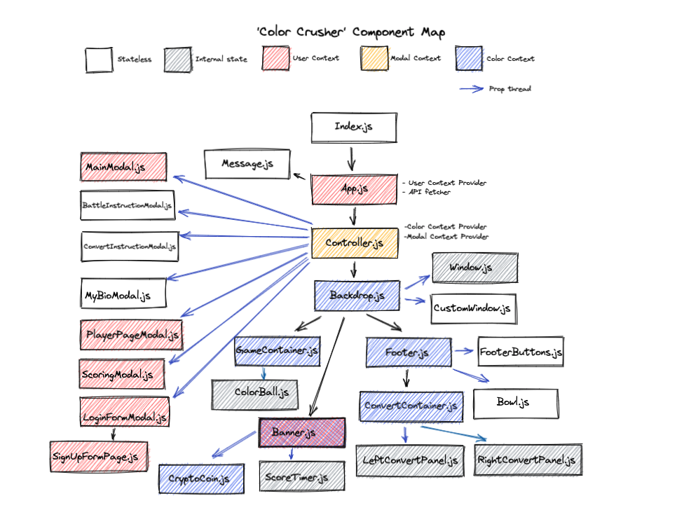
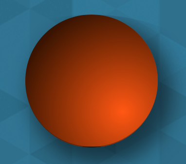
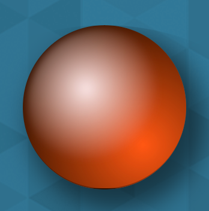
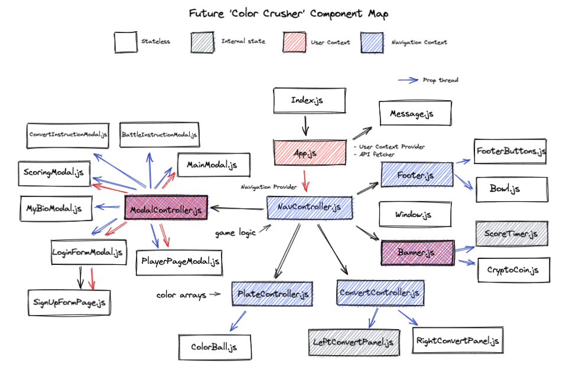

<br>

<a target="_blank" href='https://colorcrusher.herokuapp.com/'>Color Crusher</a>

<div>
	<br>
		
		
		
		
	<br>
</div>

<a href = "mailto: sirscavo@gmail.com">sirscavo@gmail.com</a>

## Component Maps created with <a target="_blank" href='https://excalidraw.com/'>Excalidraw</a>

## Further Reading
1. <a target="_blank" href='https://css-tricks.com/converting-color-spaces-in-javascript/'>Converting Color Values</a>
2. <a target="_blank" href='https://blog.bitsrc.io/pure-css-to-make-a-button-shine-and-gently-change-colors-over-time-5b685d9c6a7e'>Shimmering coin effect</a>
<!-- <h1 style='
    text-align:center;
    font-family:luminari;
    font-size: 40px;
    border: 3px solid rgb(255, 90, 0);
    height:100px;
    /* background: #67b26f;
    background: -webkit-linear-gradient(to right,  rgb(87, 189, 227), rgba(42, 81, 109));
    background: linear-gradient(to right,  rgb(87, 189, 227), rgba(42, 81, 109)); */
    display:flex;
    justify-content:center;
    align-items:center;
    color: white;
    border-radius: 5px;
    background-image: url("./src/Images/footer-blue.png");
    background-size: 75% 200%;
'>Color Crusher README</h1>

<!-- <div style='
    display: flex;
    flex-direction: column;
    align-items: center;
'>

<div style='
    height: 208px;
    width: 290px;
    border: 3px solid rgb(87, 189, 227);
    border-radius: 5px;
'>


</div>

<br>
<a href='https://colorcrusher.herokuapp.com' style='
    font-family:luminari;
    font-size: 30px;
    color: rgb(255, 90, 0);
    display: flex;
    justify-content: center;
'>Play it now! colorcrusher.herokuapp.com</a>

<br>



Image created with <a>https://excalidraw.com/</a>
</div>

<h2 style='
    font-family:luminari;
    font-size: 25px;
    display:flex;
    justify-content:center;
    align-items:center;
    color: rgb(87, 189, 227);
    margin-top: 30px;
'> ~ Objective ~ </h2>

&emsp;The purpose of **Color Crusher** was to futher my understanding of React, Javascript and CSS by building something that I haven't really seen before. Given the oddness of my app, I couldn't just copy and paste code... I was forced to understand concepts fully and adjust them to my specific needs. While I plan to explore component libraries and CSS bootstrapping in the future, for this project I sought to build as much as possible with vanilla JS and CSS.
**Color Crusher** consists of two primary features:

<br>

&emsp;**1) Convert Mode-** A tool which developers can use to convert color values and find color complements.

&emsp;**2) Battle Mode-** A game where players can practice reading RGB values.

&emsp;Creating Convert Mode gave me lots of practice building various React components such as buttons and toggle switches, as well as checking player inputs for specific requirements. The primary objective of Battle Mode was to practice some of the essentials of web development: user authentication and CRUD interactions with a database.

<h2 style='
    font-family:luminari;
    font-size: 25px;
    display:flex;
    justify-content:center;
    align-items:center;
    color: rgb(87, 189, 227);
    margin-top: 20px;
'> ~ Technologies ~ </h2>

  &emsp;**Color Crusher** is a full stack application relying heavily on the core React library. State management is achieved using the React Context API (two different contexts handle most everything: user context and color context). Instead of using __react-router__, rendering is done conditionally which allows the background to remain constant while the player navigates through the various modals. One of the few React libraries used is __react-storage-hooks__ which easily adds persistent state via local storage. Styling was painstaking done by hand using CSS modules.

  &emsp;On the backend I used a Firebase database to store player names, emails and scores and this information is fetched whenever the high scores are displayed. User authentication was done with the 'email and password' option for Firebase. The website is deployed on Heroku and kept 'awake' with a simple Google app script.

<h2 style='
    font-family:luminari;
    font-size: 25px;
    display:flex;
    justify-content:center;
    align-items:center;
    color: rgb(87, 189, 227);
    margin-top: 30px;
'> ~ Features ~ </h2>

<div style='
    display: flex;
    flex-direction: column;
    justify-content: flex-start;
    border: 1px solid rgb(255, 90, 0);
    padding: 20px;
'>

<div style='
    display: flex;
    justify-content: flex-start;
'>



<h3 style='
    color: rgb(255, 90, 0);
    font-size: 55px;
    font-family:luminari;
'> + </h3>


<h3 style='
    color: rgb(255, 90, 0);
    font-size: 55px;
    font-family:luminari;
'> = </h3>



</div>

<h3 style='
    font-size: 18px;
    display:flex;
    justify-content:center;
    align-items:center;
    color: rgb(255, 90, 0);
'>SPHERICAL 3-D EFFECT</h3>

  &emsp;Three dimensional balls were created by layering two different color gradients: one a dynamically created base color and the second a monochrome gradient which creates a shine effect. When the game board clears I change the base color to monochromatic as well, creating the "ghost ball" effect. The CSS psuedo-selector `::before` was used to avoid an unnecessary HTML element.

 Base color:

```javascript
//src/pureFunctions.js
function addStyleString (arr) {
    const newArray = []
    //iterate through the given array of colors and add the 3-D effect
    for (let i = 0; i < arr.length; i++) {
        newArray.push({
            background: `radial-gradient(
                circle at 100px 100px,
                rgb(${arr[i]}),
                #000)` })
    }
    return newArray
}
```

Shine effect:

```css
/* src/RGB/ColorBall.css */
.colorBall::before {
    content: '';
    position: absolute;
    top: 2%;
    left: 3%;
    width: 90%;
    height: 90%;
    border-radius:50%;
    background: radial-gradient(
        circle at 40% 50px,
        rgb(250, 230, 230),
        rgba(255, 255, 255, 0)
        58%
    );
    filter: blur(3px);
}
```

</div>

<div style='
    display: flex;
    flex-direction: column;
    justify-content: center;
    align-items: center;
    border: 1px solid rgb(255, 90, 0);
    padding: 20px;
    margin-top: 30px
'>

<div style='
    height: 285px;
    width: 300px;
    border: 3px solid rgb(87, 189, 227);
    border-radius: 5px;
'>


</div>

<br>

<h3 style='
    font-size: 18px;
    display:flex;
    justify-content:center;
    align-items:center;
    color: rgb(255, 90, 0);
'>DELAYED RENDERING</h3>

&emsp;I created a custom React hook which would delay the rendering of a component based on a varible argument and then used this hook for the color balls. As I move counter-clockwise throught the color balls I increase the delay, creating an interesting effect.
```javascript

//src/RGB/ColorBall.js
useEffect(() => {
    let delayRender = setTimeout(() => {
        setColor(props.color);
        setVisibility(props.visibility)
    }, props.delay)
    return () => clearTimeout(delayRender)
}, [props.color, props.visibility, props.delay])
```

</div>

<div style='
    display: flex;
    flex-direction: column;
    justify-content: flex-start;
    border: 1px solid rgb(255, 90, 0);
    padding: 20px;
    margin-top: 30px
'>

<h3 style='
    font-size: 18px;
    display:flex;
    justify-content:center;
    align-items:center;
    color: rgb(255, 90, 0);
'>COLOR VALUE CONVERSIONS</h3>

&emsp;Searching online led me to algorithms that transform RGB values into HEX and HSL values (see src/PureFunctions.js). With an HSL value in hand, simple subtraction  will give the various compliment colors on the color wheel. Further reading: https://css-tricks.com/converting-color-spaces-in-javascript/
</div>

<div style='
    display: flex;
    flex-direction: column;
    justify-content: flex-start;
    align-items: center;
    border: 1px solid rgb(255, 90, 0);
    padding: 20px;
    margin-top: 30px
'>

<div style='
    height: 61px;
    width: 97px;
    border: 3px solid rgb(87, 189, 227);
    border-radius: 5px;
'>


</div>

<br>

<h3 style='
    font-size: 18px;
    display:flex;
    justify-content:center;
    align-items:center;
    color: rgb(255, 90, 0);
'>SHIMMERING COINS</h3>

&emsp;To create the shifting silver effect on the coins and bowls I started with an image of silver foil, made it much bigger than the circle displaying it, hid the overflow and then started slowly moving the background image. Further reading: https://blog.bitsrc.io/pure-css-to-make-a-button-shine-and-gently-change-colors-over-time-5b685d9c6a7e

```CSS
.scoreTimerDiv {
    background-image: url('../../Images/Silver.jpg');
    background-size: cover;
    background-size: 250% 250%;
    overflow: hidden;
    animation: TransitioningBackground 100s linear infinite;
}

@keyframes TransitioningBackground {
    0% {
        background-position: 50% 0%;
    }
    25% {
        background-position: 100% 50%;
    }
    50% {
        background-position: 50% 50%;
    }
    75% {
        background-position: 0% 50%;
    }
    100% {
        background-position: 50% 0%;
    }
}
```
</div>

<div style='
    display: flex;
    flex-direction: column;
    justify-content: flex-start;
    align-items: center;
    border: 1px solid rgb(255, 90, 0);
    padding: 20px;
    margin-top: 30px
'>

<div style='
    height: 61px;
    width: 97px;
    border: 3px solid rgb(87, 189, 227);
    border-radius: 5px;
'>


</div>

<br>

<h3 style='
    font-size: 18px;
    display:flex;
    justify-content:center;
    align-items:center;
    color: rgb(255, 90, 0);
'>ANIMATIONS</h3>

&emsp;The timer in the upper left will flip and fall into the bowl below it whenever a player correctly guesses a color. The 'crypto coins' in the upper right will do the same, in addition to rolling off screen when the player chooses unwisely. These animations were accomplished by adding and removing class names with React and utilizing @keyframes in the CSS files.
</div>

<h2 style='
    font-family:luminari;
    font-size: 25px;
    display:flex;
    justify-content:center;
    align-items:center;
    color: rgb(87, 189, 227);
    margin-top: 30px;
'> ~ What I learned ~ </h2>

**1) CSS-** Responsiveness to screen size should be considered early and often when planning your application. While flexbox works great at component level, using the grid method for the layout makes it much easier to prioritize what gets displayed at various screen sizes.

**2) React-** Completing this project really drove home the importance of seperating concerns in state management. In Cotroller.js, I essentially created a 'brain' which does most of the thinking for the application (Its the only component that's a class instead of a function. This was a personal preference for readability). In essence, its a big switch board that sends out the ability to toggle those switches to other components. This centralization lead to unecessary rerendering and its something that I need to correct.

&emsp;I also realized the importance of removing state from the components that get rendered in order to improve reusability and testing. I found it much better to handle state in a parent component and then prop-thread needed information and functions down to the 'minions'.

**3) Firebase-** When learning full stack development I think its best to start with a tool like Firebase which simplifies Authentication and CRUD actions. This will allow students to see the overall forest of web development before focusing on specific trees like Express.

**4) Modals-** I experimented with 3 different ways to implement modals: ReactDOM.createPortal (which renders children in DOM node existing outside the DOM hieracrchy), flash messaging (which uses a pattern similar to Redux), and directly manipulating the DOM with conditional rendering. I prefer the first method.

**5) Personally-** This project confirmed my suspicions that my interests and talents lie in front-end development. However, I now have enough understanding of the back-end to build a simple one (or collaborate and communicate with people smart enough to build a complex one).

<h2 style='
    font-family:luminari;
    font-size: 25px;
    display:flex;
    justify-content:center;
    align-items:center;
    color: rgb(87, 189, 227);
'> ~ To-Do list ~ </h2>

&emsp;As you read above, the unneccessary rerendering of components is unacceptable and I plan to refactor into a component map like the one below. The creation and rendering of color balls is a concern that needs to be BELOW the overall game and navigation logic. I also need to futher remove state from any component which is being rendered and pass this responsiblity to parent components. The only two components being rendered which need an internal state are the 'scoreTimer.js' (which internally counts down) and the 'leftConvertPanel' (which does input verification).

<br>



&emsp;I greatly enjoy using the tools provided to us by Google and Firebase was no exception. I plan to become more acquainted with all the things it offers such as image hosting and cloud services. I have some familiarity with Express so my next project will combine the two. I also intend to explore Material UI... now that I've built my own components I'll see what the libraries can bring to the table.

&emsp;If you read this far then I sincerely appreciate your interest. Feel free to email me with advice, questions, job offers or just to nerd-out with me about math or colors or whatever.

<a href = "mailto: sirscavo@gmail.com">sirscavo@gmail.com</a>

<p>&#128512;</p>  -->
